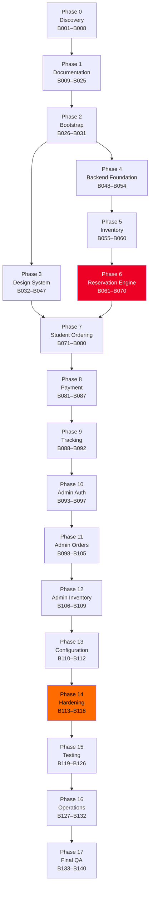
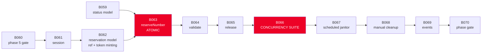

# PARTS E–I — MATRICES, GRAPHS AND EXECUTION ORDER

---

# PART E — DEPENDENCY GRAPH

## E.1 Phase-level dependencies



Phase 6 is highlighted because everything downstream inherits its correctness, and Phase 14 because it is the last point at which a security defect is cheap to fix.

## E.2 Critical path

The longest chain of genuinely blocking dependencies:

```
B001 → B003 → B004 → B007 → B012 → B014 → B015 → B026 → B048 → B050
     → B055 → B056 → B057 → B061 → B062 → B063 → B066 → B071 → B072
     → B074 → B076 → B078 → B085 → B088 → B093 → B103 → B104 → B140
```

**B066 (concurrency suite) is the single most important node.** It is the only block that produces evidence rather than code, and every downstream phase assumes its assertions hold.

## E.3 Detailed dependencies for the reservation engine



## E.4 Dependency classes

| What a block depends on | Blocks |
|---|---|
| **Nothing** (can start immediately) | B001 |
| **Documentation only** | B009–B025 |
| **Firebase configuration** | B029, B048–B054, B067 |
| **Data schema** | B049, B050, B055–B059, B075 |
| **Design tokens** | B032–B047, and every frontend block thereafter |
| **Reservation engine** | B071–B092, B106, B119–B121 |
| **Admin authentication** | B098–B112, B121 |
| **Everything** | B140 |

## E.5 Parallelisable work

Safe to run concurrently — no shared files, no conflicting architectural changes:

| Group | Blocks | Note |
|---|---|---|
| Phase 0 discovery | B002, B003, B006 | Independent reports |
| Documentation | B010, B011, B012, B013, B017, B018, B019, B020, B023 | Distinct files; B014 → B015 → B016 must stay sequential since each builds on the previous |
| Design components | B033, B034, B035, B036, B037, B039, B040, B041, B042, B043, B045 | Independent components after B032 |
| Backend vs design | Phase 3 ∥ Phase 4 | Different directories entirely; the largest available parallelism win |
| Package config | B075 ∥ B071–B074 | Backend config work is independent of the number-selection UI |
| Final QA reviews | B133, B134, B135, B137 | Independent reviews; B136 follows B135, and B138 needs all of them |

**Never parallelise:** anything within Phase 6 (each block modifies the reservation path), B032 with any component block (tokens must land first), any gate with its own phase, or B063 with B066 (writing the test alongside the implementation it validates defeats the point of the test).

---

# PART F — REQUIREMENT TRACEABILITY MATRIX

Format: Requirement → PRD section → Architecture section → Implementation blocks → Tests → Acceptance criterion.

| Requirement | PRD | Arch | Blocks | Tests | Acceptance |
|---|---|---|---|---|---|
| Students browse available numbers | §5.1 | §4.2 | B057, B072, B073 | E2E-A, unit projection | Only effectively-available numbers are listed |
| Selecting a number reserves it immediately | §5.1 | §4.3 | B063, B074 | E2E-A, concurrency 1–3 | Status becomes `reserved` with a server-set expiry |
| **No number may be sold twice** | §5.2 | §4.3 | B059, B063, B067, B085 | **Concurrency 1–12**, E2E-B | Invariant holds after every scenario |
| Reservation expires and releases | §5.2 | §4.3 | B057, B063, B067 | E2E-C, concurrency 3, 12 | Expired reservations are available with or without the janitor |
| Timer duration is configurable | §5.2 | §4.6 | B075, B110 | Integration config | TTL changes without a deploy |
| Student sees remaining time | §5.1 | §4.2 | B038, B074 | Unit countdown, E2E-D | Accurate under suspension and clock skew |
| Five package tiers selectable | §5.3 | §4.2 | B075, B076 | Component, E2E-A | All five render from config |
| Prices are configuration-driven | §5.3 | §4.6 | B075, B110 | Integration, grep check | No price literal in any component |
| Order form captures name, university, WhatsApp, email | §5.4 | §4.2 | B078 | Component, integration | All four validate on both tiers |
| Phone accepts Indonesian formats | §5.4 | §4.4 | B055, B078 | Unit ~30 inputs | Every accepted shape normalises identically |
| University restricted to allowlist | §5.4 | §4.4 | B078, B085 | Integration injection test | Off-list value refused server-side |
| Static QRIS displayed | §5.5 | §4.2 | B081 | Component, manual scan | Scans from a real device at 390 px |
| Proof upload JPG/PNG/WEBP ≤ 5 MB | §5.5 | §4.5 | B083, B084 | Integration with fixtures | Valid pass; renamed, SVG, PDF, polyglot rejected |
| Proofs stored privately | §5.5 | §4.5 | B083, B103, B113 | Rules tests, manual fetch | No unauthenticated fetch succeeds |
| Order submitted becomes pending | §5.6 | §4.3 | B085 | Integration, E2E-G | Order `pending`, number `pending` |
| Student receives a trackable reference | §5.6 | §4.4 | B062, B088 | E2E-A, unit format | Reference matches pattern, is non-sequential |
| Tracking requires no login | §5.7 | §4.4 | B089, B090 | E2E, integration | Reference + token suffices |
| Tracking is not guessable | §5.7 | §4.7 | B089 | Timing + enumeration tests | Wrong token indistinguishable from unknown reference |
| Admin verifies payment | §6.1 | §4.4 | B103, B104 | E2E-H, integration | Order `verified`, number `sold`, atomically |
| Admin rejects payment | §6.1 | §4.4 | B104 | E2E-I, integration | Order `rejected`, number `available`, note required |
| Admin manages numbers | §6.2 | §4.4 | B058, B106–B108 | Integration per transition | Illegal transitions refused |
| Admin records offline sales | §6.3 | §4.4 | B058, B108 | E2E-J | `SOLD_OFFLINE` unreservable |
| Admin manages configuration | §6.4 | §4.6 | B110, B111 | Integration, E2E | Changes reach students |
| Admin authentication required | §7.1 | §4.4 | B093–B096 | E2E-K, matrix test | No unauthenticated access anywhere |
| Two admin roles enforced | §7.1 | §4.4 | B096 | E2E-L, full matrix | Every operation × role asserted |
| No student accounts | §7.2 | §4.1 | B061 | E2E-A | Flow completes with no login |
| Expired reservations auto-cleaned | §5.2 | §4.3 | B067, B068 | Integration, concurrency 12 | Janitor releases only expired |
| Student PII minimised | §7.3 | §4.7 | B051, B089, B117 | Log audit | No unredacted PII in logs |
| Seed data reconciled and reported | §8.1 | §4.6 | B006, B056 | Integration, five cases | Report shows 96/96/0/0 |

**Coverage rule:** every business rule appears in at least one implementation block and one test. Any row that cannot be filled at B133 is a gap, not an omission.

---

# PART G — FAILURE MODE MATRIX

| Failure | Detection | User-facing behaviour | Server behaviour | Recovery | Logging | Test |
|---|---|---|---|---|---|---|
| **Reservation race** | Transaction guard fails | "Nomor ini baru saja diambil" + list refreshes | One commits, others abort with `NUMBER_UNAVAILABLE` | Automatic — student picks another | `reservation_failed` with reason | Concurrency 1–2 |
| **Reservation expires mid-flow** | `validateReservation` on step entry | Redirect to number selection with explanation; package choice preserved | Number returns to available | Student restarts selection | `reservation_expired` | E2E-C, E2E-E |
| **Submission after expiry** | Re-check inside the submit transaction | "Waktu reservasi habis" — honest, no false retry offer | Refused; uploaded proof cleaned up | Restart | `order_submit_rejected` | E2E-E, concurrency 4 |
| **Network interrupted mid-upload** | Fetch rejection | Progress halts, retry offered, file retained | Partial object not committed | Retry without re-selecting the file | `upload_failed` | B124, E2E-F |
| **Duplicate submission** | Idempotency key | Single confirmation | One order created | Automatic | `idempotent_replay` | Concurrency 5 |
| **Duplicate click on CTA** | Button lock during request | Button shows loading, ignores clicks | Single request | Automatic | — | Component test |
| **Invalid file uploaded** | Magic bytes + re-encode | Specific reason per rejection type | Rejected before storage | Choose another file | `upload_rejected` with reason | E2E-F |
| **Decompression bomb** | Decode timeout | "File tidak dapat diproses" | Decode aborted, memory bounded | Choose another file | `upload_rejected` reason=timeout | B083 test |
| **Stale browser state** | Server revalidation on focus and step entry | UI corrects itself silently | Server state is truth | Automatic | — | E2E-D |
| **Server restart during reservation** | Reservation lives in Firestore, not memory | No visible impact | Reservation survives | None needed | — | B124 |
| **Scheduled function fails** | Alert: no run in 15 minutes | **None** — lazy expiry keeps behaviour correct | Stored statuses go stale; effective status stays right | Manual cleanup (B068) | `cleanup_failed` + alert | B124 |
| **Firestore unavailable** | Operation throws | "Sistem sedang bermasalah" + retry | 503 with correlation ID; readiness red | Automatic on restore | `firestore_unavailable` + alert | B124 |
| **Storage unavailable** | Upload throws | Retry offered; typed data preserved | Order not created | Retry | `storage_unavailable` + alert | B124 |
| **Unauthorized admin request** | Token verification fails | Redirect to login, or 401 for API | Refused before any handler logic | Re-authenticate | `auth_denied` | E2E-K |
| **Config document deleted** | Read returns nothing | Clear actionable error, not a crash | Operation refused | Admin restores config | `config_missing` + alert | B124 |
| **Package missing or inactive** | Validation at package step and at submit | Selection cleared, explained at the package step | Submission refused | Choose another package | `package_unavailable` | B077 test |
| **University missing** | Allowlist validation | Field error | Refused | Choose another | `validation_failed` | B078 test |
| **Number unavailable at selection** | Transaction guard | Marked unavailable, list refreshes | `NUMBER_UNAVAILABLE` | Automatic | `reservation_failed` | B073 test |
| **Payment rejected by admin** | Status change | Tracking shows rejection with the admin's note | Number returns to available | Student may reorder | `order_rejected` | E2E-I |
| **Malformed tracking request** | Schema validation | Generic "tidak ditemukan" | 400 or 404, never distinguishing cause | Re-enter credentials | `tracking_lookup_failed` | B089 test |
| **Two admins act on one order** | Transaction re-check | Second admin told it was already handled | Exactly one decision applies | None needed | `order_action_conflict` | B104 test |
| **Rate limit exceeded** | Counter check | "Terlalu banyak percobaan" with countdown | 429 + `Retry-After` | Wait | `rate_limited` | B115 test |
| **Rate limiter backend fails** | Firestore error inside limiter | No visible impact (fairness limits) | Fails open with warning; **tracking fails closed** | Automatic | `rate_limiter_degraded` + alert | B052 test |

---

# PART H — SECURITY THREAT MODEL

| # | Threat | Vector | Mitigation | Verification |
|---|---|---|---|---|
| T1 | **Unauthorized admin access** | Guessing an admin URL; forging a role claim | Firebase Auth; role read only from a verified token; every route and endpoint independently guarded; middleware is an optimisation, not the control | E2E-K; B095 test with middleware disabled |
| T2 | **IDOR on orders** | Iterating order IDs or references | Non-sequential CSPRNG references; a reference alone is insufficient; token required and compared in constant time | B089 enumeration test |
| T3 | **Tracking enumeration** | Brute-forcing references or tokens | 32-byte token; identical response and timing for wrong-token and unknown-reference; aggressive per-IP and per-reference rate limiting that **fails closed** | B089 timing test; B115 |
| T4 | **Unrestricted Storage access** | Guessing object paths; leaked URLs | Private bucket; no public rules; UUID paths; 5-minute signed URLs minted per request and never stored | B113 unauthenticated fetch; rules tests |
| T5 | **Malicious file upload** | Polyglot, SVG with script, decompression bomb, oversized body | Magic-byte sniff + `sharp` re-encode + dimension cap + decode timeout + streamed size cap | B083 fixture suite including a crafted polyglot and a bomb |
| T6 | **Firestore write abuse** | Direct client SDK writes with the public config | Deny-by-default rules; no client SDK write path exists in the codebase; ESLint bans the import | B113 with the real production config |
| T7 | **Reservation hoarding** | Repeated reserve/release to deny the pool | One live reservation per session; churn limit; App Check on public endpoints | B115 churn test |
| T8 | **Brute-force reservation** | Scripted reservation attempts | Per-session and per-IP limits; App Check; server-controlled session cookie | B115 |
| T9 | **Admin credential brute force** | Password guessing | Per-IP and per-email limits; identical error for wrong password and unknown account | B094 test |
| T10 | **Exposed secrets** | Secret bundled into client code or committed | Env validation separating server from public; bundle grep; history scan; Secret Manager | B117 (built bundle, not source) |
| T11 | **PII leakage via logs** | Careless logging of phone, email, name, token | Redaction applied **at the logger**, not at call sites; full-flow log audit | B117 with a deliberate PII log attempt |
| T12 | **Overly broad Firestore rules** | Rules relaxed for convenience during development | Deny-by-default start; every exception commented with its requirement; four-identity test coverage | B113 |
| T13 | **Client-side privilege escalation** | Editing client state to reveal admin actions | Role UX guards never act as the control; every operation authorises server-side | E2E-L over the full matrix |
| T14 | **Session fixation or theft** | Forged or stolen session cookie | `httpOnly`, `Secure`, `SameSite`; CSPRNG values; server-side revocation on logout | B061, B096 tests |
| T15 | **Open redirect after login** | Crafted `redirect` parameter | Target validated as a relative admin path | B094 test |
| T16 | **XSS** | Injected content rendered as markup | React escaping; nonce-based CSP without `unsafe-inline`; no `dangerouslySetInnerHTML` | B116; console review |
| T17 | **CSRF on admin actions** | Cross-site form post | `SameSite=Strict` admin cookie; JSON-only endpoints; no cookie-authenticated GET mutations | B096 test |
| T18 | **Admin acting on stale data** | Two admins verifying the same order | Transaction re-check; second admin informed | B104 concurrent test |
| T19 | **Proof access without trace** | Admin viewing proofs unaudited | Every proof access writes an audit record | B103 test |
| T20 | **Metadata leakage from proofs** | EXIF GPS in a student's photo | Re-encode strips all metadata | B083 EXIF assertion |

---

# PART H.2 — UI STATE MATRIX

Every student screen must implement every applicable state. A screen that only implements the happy path fails its block.

| State | Nomor | Paket | Data | Bayar | Konfirmasi | Lacak |
|---|:--:|:--:|:--:|:--:|:--:|:--:|
| Loading (skeleton) | ● | ● | ● | ● | ● | ● |
| Empty | ● | ● | — | — | — | ● |
| Normal | ● | ● | ● | ● | ● | ● |
| Item selected | ● | ● | — | — | — | — |
| Disabled CTA (nothing selected) | ● | ● | ● | ● | — | ● |
| Validation error | — | — | ● | ● | — | ● |
| Network error + retry | ● | ● | ● | ● | — | ● |
| Server error | ● | ● | ● | ● | — | ● |
| Reservation expired | ● | ● | ● | ● | — | — |
| Reservation taken over | ● | ● | ● | ● | — | — |
| Submission in flight | ● | — | — | ● | — | — |
| Upload in progress | — | — | — | ● | — | — |
| Upload failed + retry | — | — | — | ● | — | — |
| Rate limited | ● | — | — | ● | — | ● |
| Success | — | — | — | — | ● | ● |
| Not found | — | — | — | — | — | ● |
| Config missing | — | ● | ● | ● | — | — |

**Admin screens** additionally implement: unauthorized, forbidden-for-role, no-results-for-filter, action-in-flight, action-conflict (already handled by another admin), and confirmation-pending.

---

# PART I — FINAL EXECUTION ORDER

Execute in this order. Do not begin a phase until its predecessor's gate has passed.

## Sequential order

```
Phase 0   B001 B002 B003 B004 B005 B006 B007 B008◆
Phase 1   B009 B010 B011 B012 B013 B014 B015 B016 B017 B018 B019
          B020 B021 B022 B023 B024 B025◆
Phase 2   B026 B027 B028 B029 B030 B031◆
Phase 3   B032 B033 B034 B035 B036 B037 B038 B039 B040 B041 B042
          B043 B044 B045 B046 B047◆
Phase 4   B048 B049 B050 B051 B052 B053 B054◆
Phase 5   B055 B056 B057 B058 B059 B060◆
Phase 6   B061 B062 B063 B064 B065 B066★ B067 B068 B069 B070◆
Phase 7   B071 B072 B073 B074 B075 B076 B077 B078 B079 B080◆
Phase 8   B081 B082 B083★ B084 B085 B086 B087◆
Phase 9   B088 B089 B090 B091 B092◆
Phase 10  B093★ B094 B095 B096 B097◆
Phase 11  B098 B099 B100 B101 B102 B103 B104 B105◆
Phase 12  B106 B107 B108 B109◆
Phase 13  B110 B111 B112◆
Phase 14  B113 B114 B115 B116 B117 B118◆
Phase 15  B119 B120 B121 B122 B123 B124 B125 B126◆
Phase 16  B127 B128 B129 B130 B131 B132◆
Phase 17  B133 B134 B135 B136 B137 B138 B139 B140◆
```

`◆` = verification gate, must pass before proceeding · `★` = highest-risk block, review the diff carefully

## Recommended parallel schedule

If more than one implementer is available:

| Track | Blocks | Joins at |
|---|---|---|
| **Main** | B001 → B031, then B048 → B070 | — |
| **Design** | B032 → B047 (starts after B031) | B071 |
| **Docs** | B010–B013, B017–B020, B023 (after B009) | B025 |
| **Config** | B075, B111 (after B054) | B076 |
| **QA** | B133, B134, B135, B137 (after B132) | B138 |

Phase 3 (design) and Phase 4 (backend) running in parallel is the largest available saving — they share no files.

## Phase weight

Rough distribution of effort, for planning purposes rather than estimation:

| Phase | Blocks | Weight |
|---|---|---|
| 0–2 Discovery, docs, bootstrap | 31 | 18 % |
| 3 Design system | 16 | 12 % |
| 4–5 Backend and inventory | 13 | 10 % |
| **6 Reservation engine** | **10** | **12 %** |
| 7–9 Student flow | 22 | 20 % |
| 10–13 Admin | 20 | 15 % |
| 14–17 Hardening, testing, ops, QA | 28 | 13 % |

Phase 6 carries a disproportionate weight for its block count. That is intentional: ten small, carefully-ordered blocks and a twelve-scenario concurrency suite are what stand between this system and the exact problem it was built to solve.

## Stop conditions that halt the whole project

Escalate rather than working around any of these:

1. **B066 fails after the transaction guard is restored** — the concurrency model is wrong, and every downstream phase is built on sand.
2. **B083 cannot install `sharp` in the target runtime** — the upload validation strategy needs re-planning, not downgrading.
3. **B093 cannot set custom claims** — the authorization mechanism needs re-planning; do not fall back to a client-readable role.
4. **B113 finds any client identity can read order PII or a payment proof** — a live data exposure.
5. **B117 finds a secret in the built bundle or in Git history** — rotate credentials and rewrite history before continuing.
6. **B134 finds any attempted attack succeeds** — blocking, regardless of schedule pressure.
7. **B140 Security or Backend section unmet** — the system does not ship.
