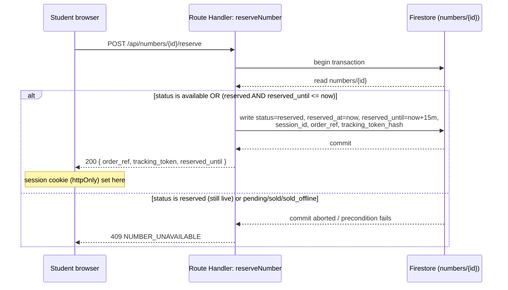
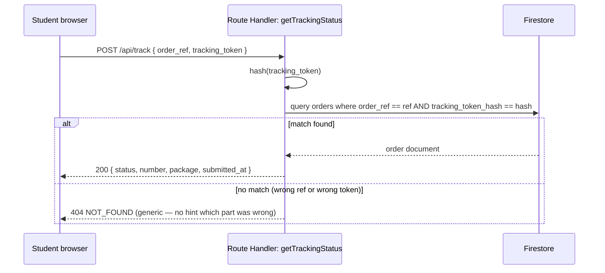
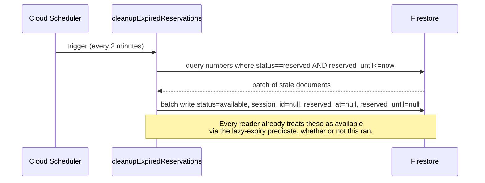
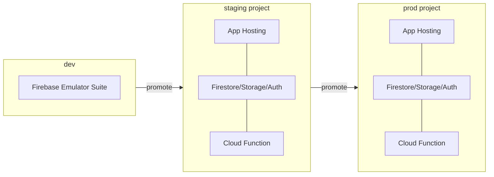

# ARCHITECTURE.md

## Component overview

```
┌─────────────────────────────────────────────────────────────────┐
│ Browser (student — unauthenticated / admin — Firebase Auth)      │
│  Next.js client components — no Firestore/Storage SDK usage      │
└───────────────────────────┬───────────────────────────────────────┘
                             │ fetch() — same-origin, cookie-based session
┌───────────────────────────▼───────────────────────────────────────┐
│ Next.js App Router — Node runtime (Firebase App Hosting)          │
│  ┌─────────────────────────┐   ┌───────────────────────────────┐ │
│  │ Server Components / RSC │   │ Route Handlers (src/app/api)   │ │
│  │ — read-only projections │   │ — THE TRUSTED TIER              │ │
│  └─────────────────────────┘   │ firebase-admin, service acct   │ │
│                                 └──────────────┬──────────────────┘ │
└──────────────────────────────────────────────────┼──────────────────┘
                                                     │ Admin SDK
                     ┌───────────────────────────────┼───────────────────────────┐
                     ▼                               ▼                           ▼
              Cloud Firestore                 Cloud Storage              Firebase Auth
        numbers / orders / config        proofs/ (private bucket)   admin users + custom claims
                     ▲
                     │ Admin SDK, every 2 min
        ┌────────────┴─────────────┐
        │ Cloud Function (2nd gen)  │
        │ cleanupExpiredReservations│  ◄── triggered by Cloud Scheduler
        └────────────────────────────┘
```

## Frontend structure and server/client boundary policy

Server Components render read-only projections (number list, package list, order confirmation display) fetched via the trusted tier — never via a direct Firestore read from a Server Component either, so that Route Handler is the single place authorization and validation logic lives. Client Components handle interactivity (selection, form state, upload progress, the countdown timer) and call Route Handlers via `fetch`. No component of either kind imports `firebase/firestore` or `firebase/storage` client packages — those imports are ESLint-banned outside a single, never-written client SDK wrapper reserved for future use (`AGENTS.md`).

## The trusted tier

A Route Handler qualifies as "trusted" by construction: it runs server-side on Node, initializes `firebase-admin` with a service account (local: emulator credentials; deployed: Application Default Credentials), and is the only code path with write access to Firestore/Storage. Every one of the twenty operations in `API_SPEC.md` is implemented as exactly one Route Handler. This is the architectural decision recorded in `docs/reports/architecture-recommendation.md` §2 and ratified in ADR-001.

## Firestore usage

Single-document transactions on `numbers/{numberId}` are the concurrency primitive for reservation and status transitions (ADR-004). `orders/{orderId}` documents are written once at submission and updated only by admin verify/reject operations (each itself a transaction, to handle the "already verified by another admin" edge case in `PRD.md`). `config/*` documents are read-heavy, write-rare, and cached at the Route Handler layer with a short TTL (see `API_SPEC.md`).

## Auth and custom claims

Firebase Authentication, email/password, admin-only. `role: 'ADMIN_KAMPUS' | 'ADMIN_TELKOMSEL'` set as a custom claim via the Admin SDK (never self-service). Every admin Route Handler verifies the ID token server-side and checks the claim — middleware provides a client-side redirect for UX only; it is not a security control (ADR-002).

## Storage topology

`gs://<project>.appspot.com/proofs/{orderId}-{timestamp}.{ext}`, private, no public read rule. Written only by the `submitOrder` Route Handler after `sharp` re-encoding. Read only via `adminGetProofUrl`, which mints a 5-minute signed URL after the role check.

## The scheduled function

`cleanupExpiredReservations`, Cloud Function 2nd gen, triggered by Cloud Scheduler every 2 minutes. Queries `numbers` where `status == 'reserved' && reserved_until <= now`, batch-writes them back to `available`. This function's own downtime never violates correctness (§ below) — it exists to keep the admin dashboard's counts honest and Firestore's stored state tidy, nothing more.

## Configuration and environment variables

See `DEPLOYMENT.md` / `.env.example` for the full list. Server-only secrets (service account details when not using ADC) never carry the `NEXT_PUBLIC_` prefix; only genuinely public values (Firebase web config, which is not a secret) do.

## Public/private data boundary

Public (no auth required): sampled available-number list, package list, university list, payment config (QR image + label), tracking lookup (given the correct token). Private (admin auth required): full order list, any single order's full detail, proof signed URLs, number management mutations, config mutations. Nothing in Firestore or Storage is reachable by an unauthenticated direct client request — the boundary is enforced entirely at the Route Handler layer plus the deny-by-default security rules as backstop.

## Why lazy expiry is authoritative, and the cron is not

If reservation validity were determined by "has the cleanup job run yet," a missed run (deploy gap, quota, cold start) would leave an actually-expired reservation looking live to every reader — blocking a number no one holds. Instead, every code path that reads a `numbers` document evaluates `status === 'reserved' && reserved_until <= serverTime` as available _before_ trusting the stored `status` field at all. The transactional write path (`reserveNumber`) re-checks this predicate inside the transaction itself, against a server-generated timestamp, so two concurrent reservers of an about-to-expire number resolve correctly regardless of cron timing. The cron's only job is hygiene — see `docs/reports/architecture-recommendation.md` §4 for the full argument.

## Sequence diagrams

### Reservation



### Order submission with upload

```mermaid
sequenceDiagram
    participant S as Student browser
    participant RH as Route Handler: submitOrder
    participant SH as sharp (re-encode)
    participant ST as Cloud Storage
    participant FS as Firestore
    S->>RH: POST /api/orders (multipart: form fields + proof file, session cookie)
    RH->>RH: validate session cookie matches numbers/{id}.session_id
    RH->>RH: validate reservation not expired
    RH->>RH: Zod-validate form fields
    RH->>RH: magic-byte check on file
    RH->>SH: decode + re-encode (strips EXIF, defeats polyglots)
    SH-->>RH: clean image buffer
    RH->>ST: write proofs/{orderId}-{ts}.{ext}
    RH->>FS: transaction: numbers/{id} reserved→pending; orders/{orderId} create (status=pending)
    FS-->>RH: commit
    RH-->>S: 201 { order_ref } (tracking_token already known from reservation step)
```

### Admin verification

```mermaid
sequenceDiagram
    participant A as Admin browser
    participant RH as Route Handler: adminVerifyPayment
    participant FS as Firestore
    A->>RH: POST /api/admin/orders/{id}/verify (ID token)
    RH->>RH: verify ID token + role claim
    RH->>FS: transaction: orders/{id} status must be pending
    alt still pending
        RH->>FS: orders/{id}.status=verified, verified_at, verified_by;<br/>numbers/{num}.status=sold, sold_at
        FS-->>RH: commit
        RH-->>A: 200 OK
    else already verified/rejected by a concurrent admin
        FS-->>RH: precondition fails
        RH-->>A: 409 CONFLICT (already actioned)
    end
```

### Tracking lookup



### Expiry cleanup (hygiene, not authority)



## Deployment topology



Three separate Firebase projects, never shared collections with a prefix — see ADR-009.

## Rollback

App: App Hosting keeps prior build artifacts; rollback is a target-revision switch, no data migration involved. Rules (`firestore.rules`/`storage.rules`): versioned in Firebase's rules history, rollback via `firebase deploy --only firestore:rules` against a prior committed version — never edited live in the console. Indexes: additive changes are safe to roll forward; a removed index is only safe to roll back if no deployed code path depends on it, checked manually before removal. Functions: prior revision redeploy, same as App Hosting.

## Observability

Structured JSON logs, correlation ID per request (propagated from Route Handler into any Admin SDK call), redaction rules per `SECURITY.md`/ADR-010. No client-side error tracking beyond what's needed to debug UI issues — no student PII in client-side logs.
