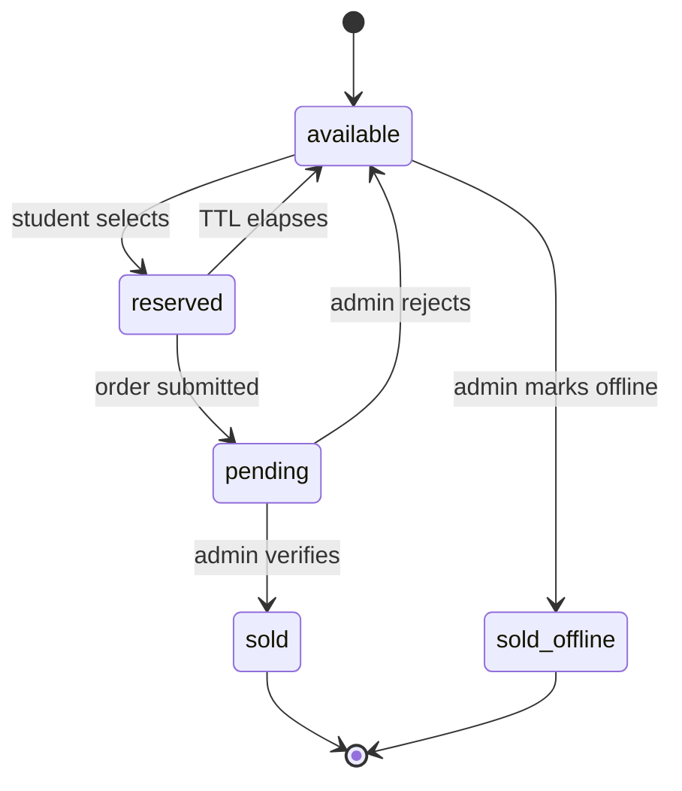

# ADR-003: Number Status Lifecycle

**Status:** Accepted
**Date:** 2026-08-20
**Owning blocks:** B021, Phase 5–9 (all number/order status mutations)

## Context

The specification contradicts itself twice on this point (`docs/reports/contradiction-audit.md` C10, C11). §7's status table lists four states (`AVAILABLE`, `RESERVED`, `PENDING`, `SOLD`) while §6.5 introduces a fifth (`SOLD_OFFLINE`) that never appears in the §7 table. Separately, §6.2 says a submitted order leaves the number "RESERVED" while §7's own transition table says RESERVED → PENDING on submission — two different states for the same moment.

## Decision

Five states: `available | reserved | pending | sold | sold_offline`.

### Transition table

| From           | To             | Trigger                                                | Authorised actor                                                                    |
| -------------- | -------------- | ------------------------------------------------------ | ----------------------------------------------------------------------------------- |
| `available`    | `reserved`     | Student selects the number                             | `reserveNumber` (system, no auth)                                                   |
| `reserved`     | `pending`      | Student submits a complete order before expiry         | `submitOrder` (system, no auth, session-gated)                                      |
| `reserved`     | `available`    | Reservation TTL elapses (lazily evaluated, or janitor) | System (no human actor)                                                             |
| `pending`      | `sold`         | Admin verifies payment                                 | `adminVerifyPayment` (either admin role)                                            |
| `pending`      | `available`    | Admin rejects payment                                  | `adminRejectPayment` (either admin role)                                            |
| `available`    | `sold_offline` | Admin records a direct/offline sale                    | `adminMarkSoldOffline` (`ADMIN_TELKOMSEL` only)                                     |
| `sold`         | —              | No automatic transition                                | Admin override only, via `adminUpdateNumber` correction path, never a standard flow |
| `sold_offline` | —              | No automatic transition                                | Admin override only, same as above                                                  |

**Illegal transitions, stated explicitly (not left implied):** `reserved → sold` (must pass through `pending`), `available → pending` (must pass through `reserved`), `sold → available` or `sold_offline → available` via any standard operation (only a manual admin correction, logged as such, may do this — e.g. reversing a data-entry mistake), `pending → sold_offline` (a number under active online review is never simultaneously eligible for offline marking — `adminMarkSoldOffline` requires `available` and fails with `CONFLICT` otherwise, per `API_SPEC.md`).

### Resolution of the spec's internal contradiction (§6.2 vs §7)

**§7 wins: a submitted order moves the number to `pending`, it does not "stay reserved."** The alternative reading is unsafe: if the number remained `reserved` while an order awaited admin review, its `reserved_until` timestamp — set at selection time, before the student even filled in the form — would continue counting down independent of the order's actual state. A slow admin queue could let that TTL lapse while a real, paid-for order sat waiting for review, and the lazy-expiry predicate (ADR-004) would then treat the number as available to a second student. Moving to `pending` removes the number from the janitor's/predicate's concern entirely — `pending` has no TTL and no automatic transition, so it cannot be silently reclaimed out from under a live order.

## Alternatives considered

- **Keep §6.2's "stays RESERVED" reading and extend `reserved_until` on submission instead.** Rejected: this would work but adds a second TTL-management code path (extend-on-submit) purely to compensate for using the wrong state; moving to `pending` is simpler and removes the TTL concern from that phase of the lifecycle entirely rather than managing around it.
- **Four states only, treating offline sales as `sold` with a channel flag instead of a distinct status.** Rejected: `DATA_MODEL.md` does add a `sold_channel` field, but keeping `sold_offline` as its own status (not just a flag on `sold`) makes the admin dashboard's "numbers sold offline" count a direct status filter rather than a compound query, and matches spec §6.5's own language ("mark as SOLD_OFFLINE") directly.

## Consequences

Every E2E scenario (master prompt §45) must terminate in one of these five states — verified by tracing all twelve scenarios through the diagram above (`docs/reports/phase-0-summary.md`... verification step repeated at the Phase 1 gate, B025). Adding a sixth state later (e.g. a `disputed` status) would touch every operation in `API_SPEC.md` that currently switches on status — an expensive change, correctly gated behind an ADR rather than a config value.

## Verification

Unit tests on the `src/domain` transition-validator function assert every legal transition succeeds and every illegal one (including the two explicitly called out above) is rejected before it ever reaches a Firestore write.
